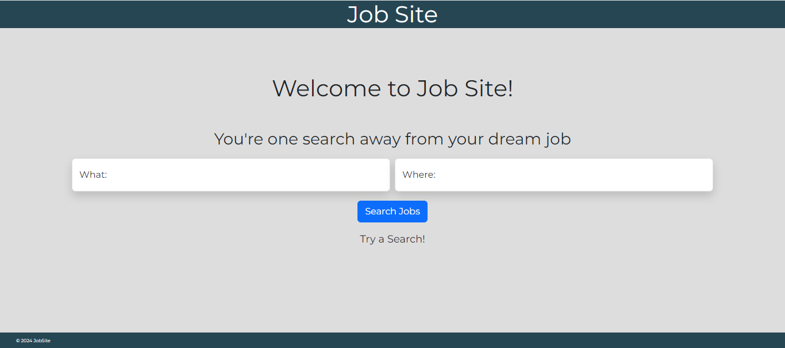
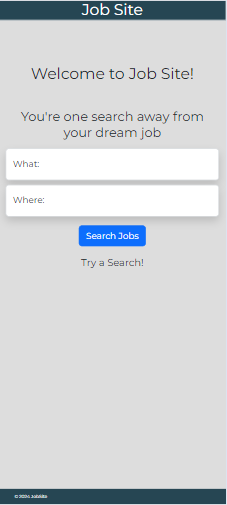
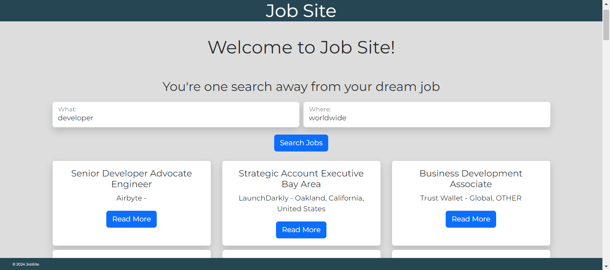
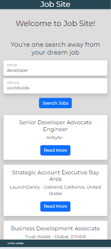

# Job Site

## Description 

This project is a Job scrapping web application using my own React template and axios to access the data from `https://remoteok.io/api` to display the job vacancies of tech jobs.

## WHY?

I chose to embark on this project for several reasons. First and foremost, I wanted to gain a more hands-on understanding of React, a widely-used JavaScript library for building user interfaces. Additionally, I aimed to deepen my proficiency in working with REST (Representational State Transfer) APIs, which play a crucial role in modern web development. By combining these objectives, I saw this project as an excellent opportunity to challenge myself and explore the intricacies of React further.

Moreover, as I actively pursue employment opportunities, I recognized the importance of expanding my knowledge and enhancing my portfolio. This project not only allowed me to sharpen my skills but also provided a tangible demonstration of my capabilities to potential employers. By immersing myself in this endeavor, I aimed to not only broaden my technical expertise but also actively engage in the job market, leveraging my newfound skills to seek out and apply for relevant vacancies.

## Model 
### Home
| Desktop              | Mobile         |
| ------------------------ | ---------------------- |
|  | 

My application boasts a simple yet effective design, enhanced by the integration of Bootstrap for features such as a Navbar and floating inputs, significantly improving usability and accessibility. I've ensured the website remains functional across all devices by leveraging Bootstrap breakpoints, as demonstrated in the images above.

Managing user input is a top priority, including validation to ensure only valid inputs are accepted. Additionally, i've implemented the 'required' attribute to mitigate potential security vulnerabilities.

To handle user input dynamically, i've employed React's `useState()` hook, allowing me to seamlessly manage user input and pass it to the apijobs.jsx component for making `GET` requests to the third-party API.

Ternary operators have proven invaluable in this application, enabling me to display a loading screen while data is being fetched, as well as gracefully handling errors in cases where the user's input yields no results. This ensures a seamless and informative user experience.

## Searched
| Desktop              | Mobile         |
| ------------------------ | ---------------------- |
|  | 

After receiving a valid response from the GET request and passing it to apijobs.jsx, the data undergoes checks to ensure it's an array with a length greater than 0. Given that this third-party API includes terms and conditions as the first object in the array, I utilize the .slice() method to remove it. Subsequently, I map over the remaining array elements and format the necessary data into Bootstrap card components.

Bootstrap breakpoints play a crucial role once again, allowing for enhanced accessibility across various devices and ensuring a visually appealing and organized layout.

The card not only displays pertinent details such as title, location, and company but also includes a URL directing users to a webpage for further information about the selected vacancy.

## Languages

- Html
- CSS
- Javascript
- React
- Node.js
- Express.js
- Axios
- Bootstrap 
- Babel
- Webpack

## Problems Encountered

- sending `GET` requested to the API.
- config the webpack file correctly.
- correctly passing props from one component to another.
- accessing data correctly once getting an API response. 

## New Skills

- Applying `css-loader` to the Webpack file to add styling to the web app.
- Working with Axios.
- Making `GET` requests to third party API's
- Working with ternary operators in the HTML to display certain things.
- Having a better understanding about `useState()`.
- Getting more hands on with `Async` functions and the uses of `Await`.
- Having more experience with Bootstrap breakpoints.

## Resources

- [RemoteOk API](https://remoteok.io/api)
- [Bootstrap](https://getbootstrap.com/)
- [FreeCodeCamp reference](https://www.freecodecamp.org/news/how-i-built-a-job-scraping-web-app-using-node-js-and-indreed-7fbba124bbdc)


## Setup 

Clone the repository:
```
git clone https://github.com/SReddy-96/jobsite.git
cd jobsite
```

Install dependencies:
```
npm install 
```

Build the project:
```
npm run build 
```

Start the server:
```
npm start
```
The application can be viewed on `http://localhost:3000/`
